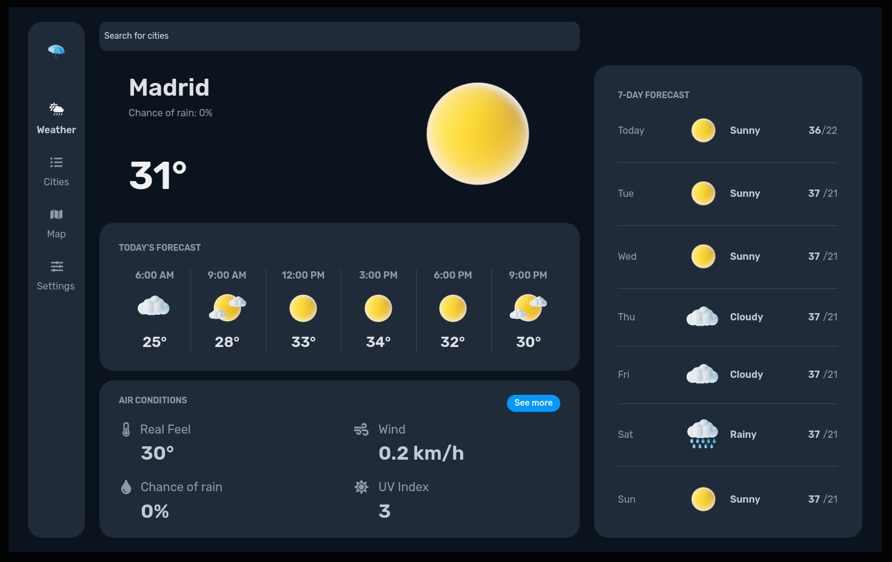

<h1>☂️ Weather Now</h1>

<ol>
  <li><a href="#description"><a href="#description">Descrição</a></li>
  <li><a href="#features">Funcionalidades</a></li>
  <li><a href="#requirements">Requisitos</a></li>
  <li><a href="#technologies-used">Tecnologias Utilizadas</a></li>
  <li><a href="#installation-and-configuration">Instalação e Configuração</a></li>
  <li><a href="#ux-ui">UX/UI de Inspiração</a></li>
  <li><a href="#project-architecture">Arquitetura do Projeto</a></li>
  <li><a href="#production-environment">Ambiente de produção</a></li>
  <li><a href="#contribution">Contribuição</a></li>
  <li><a href="#license">Licença</a></li>
  <li><a href="#future-expansion-points">Pontos de Expansão Futuros</a></li>
  <li><a href="#estimated-schedule">Cronograma Estimado</a></li>
  <li><a href="#author">Autor</a></li>
</ol>

<h2 id="description">Descrição</h2>

Este projeto implementa uma interface web para busca e visualização de informações climáticas utilizando **Vite**.

<h2 id="features">Funcionalidades</h2>

- **Previsão por localização**: Permite buscar a previsão climática de acordo com a localização do dispositivo.
- **Previsão por busca**: Permite buscar a previsão climática por cidade.
- **Previsão atual**: Exibe a previsão climática atual.
- **Previsão do dia**: Exibe a previsão das próximas horas do dia.
- **Previsão da semana**: Exibe a previsão dos próximos 7 dias.
- **Condições do ar**: Exibe informações sobre as condições do ar.

<h2 id="requirements">Requisitos</h2>

### Requisitos Funcionais

- Acesso a localização do dispositivo.
- Exibição de informações climáticas.
- Atualização das informações em tempo real.

### Requisitos Não Funcionais

- **Segurança**: -
- **Escalabilidade**: -
- **Manutenibilidade**: -

<h2 id="technologies-used">Tecnologias Utilizadas</h2>

- **Vite**: Framework principal.
- **TypeScript**: Linguagem de programação.
- **Tailwindcss**: Para customização dos componentes.
- **OpenWeather**: API de dados climáticos.
- **TanStack Query**: Gerenciamento de estados e controle de dados.
- **Netlify**: Para ambiente de produção.

<h2 id="installation-and-configuration">Instalação e Configuração</h2>

### Pré-requisitos

- Node.js
- Pnpm

### Passos para Instalação

1. Clone o repositório:

```bash
git clone https://github.com/F4GN3R/weather-now
```

2. Instale as dependências:

```bash
$ cd weather-now && pnpm install
```

3. Configure as variáveis de ambiente no arquivo `.env`:

```bash
# OPEN WEATHER
OPEN_WEATHER_URL=""
OPEN_WEATHER_API_KEY=""
```

4. Inicie o servidor:

```bash
# development
$ pnpm run dev

# production mode
$ pnpm run preview
```

5. Acesse a aplicação em:

```bash
http://localhost:5173
```

<h2 id="ux-ui">UX/UI de Inspiração</h2>



<h2 id="project-architecture">Arquitetura do Projeto</h2>

### Componentes

- **-**: -.
- **-**: -.
- **-**: -.

<h2 id="production-environment">Ambiente de produção</h2>

Para produção, escolhemos a plataforma [Netlify](https://www.netlify.com/) para a aplicação.

```bash
https://-
```

<h2 id="contribution">Contribuição</h2>

1. Faça um fork do projeto.
2. Crie uma nova branch para a feature (`git checkout -b feature/nova-feature`).
3. Commit suas mudanças (`git commit -am 'Adiciona nova feature'`).
4. Faça o push para a branch (`git push origin feature/nova-feature`).
5. Abra um Pull Request.

<h2 id="license">Licença</h2>

Este projeto está licenciado sob a licença MIT - veja o arquivo [LICENSE](LICENSE) para mais detalhes.

<h2 id="future-expansion-points">Pontos de Expansão Futuros</h2>

- **Armazenamento das ultimas localizações**: Salvar as últimas buscas realizadas para consulta.
- **Tema**: Permitir a preferência de tema (system/dark/light).
- **Multi Idiomas**: Visualização em PT-BR, EN e SP.
- **Logs de Acesso**: Registrar acessos e interações com a aplicação.
- **Registro de usuários**: Permitir contatos de usuários para registro de bugs ou sugestões.

<h2 id="estimated-schedule">Cronograma Estimado</h2>

| Fase                       | Tempo Estimado |
| -------------------------- | -------------- |
| Levantamento de Requisitos | 1 dia          |
| Configuração do Projeto    | 1 dia          |
| Desenvolvimento Frontend   | 2 dias         |
| Integrações                | 2 dias         |
| Testes e Correções         | 2 dias         |
| Documentação               | 1 dia          |
| Deploy em produção         | 1 dia          |
| **Total estimado**         | **10 dias**    |

<h2 id="author">Autor</h2>

<table style="padding: none;">
  <tr>
    <td>
      <a href="https://github.com/F4GN3R">
        
      </a>
    </td>
    <td>
     <b>Fagner Morais</b>
     <br/>
    <small>Full Stack Developer and Senior System Analist</small>
    </td>
  </tr>
</table>

[](https://github.com/F4GN3R)
[](https://www.linkedin.com/in/fagner-morais-6732a7130/)

Esse `README.md` serve como uma documentação completa do projeto e pode ser utilizado diretamente no GitHub.
